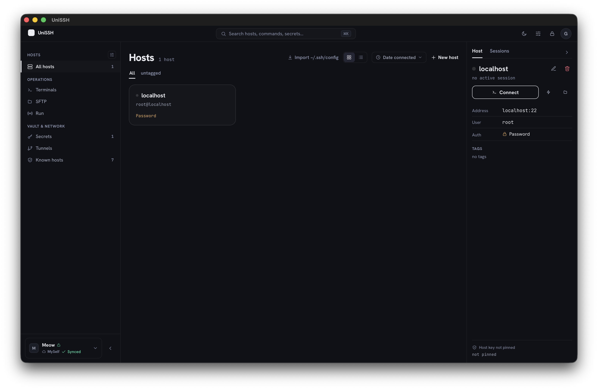
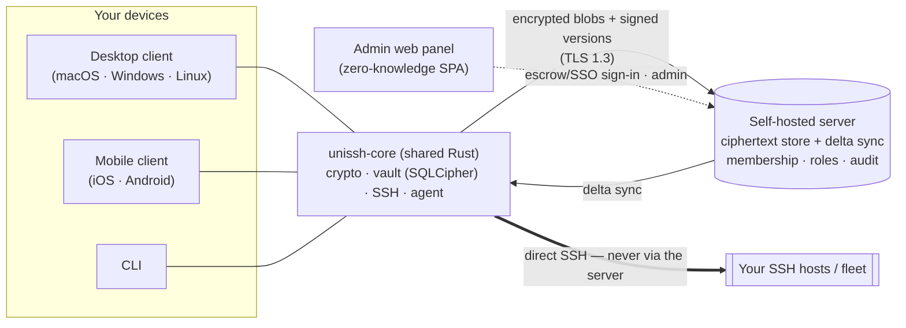

<div align="center">

# UniSSH

**A cross-platform SSH client with end-to-end-encrypted vaults that sync through a server _you_ host.**

_Your keys, your hosts, your server. No cloud account, no vendor lock-in — and a server that can't read a single byte of your data._

[](#license)
[](#components)
[](#components)
[](#security--privacy)
[](https://github.com/goduni/unissh/actions)
[](https://github.com/goduni/unissh/releases)
[](https://github.com/goduni/unissh)

<br/>



</div>

---

## Contents

- [Why UniSSH?](#why-unissh)
- [Features](#features)
- [Screenshots](#screenshots)
- [How it works](#how-it-works) · [Identity model](#identity-model)
- [Components](#components)
- [Quick Start](#quick-start) — [get the client](#a-get-the-client) · [self-host a server](#b-self-host-a-sync-server-optional) · [admin panel](#c-open-the-admin-panel)
- [Installing unsigned builds](#installing-unsigned-builds)
- [Configuration](#configuration)
- [Security & Privacy](#security--privacy)
- [Build from source](#build-from-source)
- [Contributing](#contributing)
- [Community](#community) — [supporting the project](#supporting-the-project)
- [FAQ / Troubleshooting](#faq--troubleshooting)
- [License](#license)

---

## Why UniSSH?

Most polished SSH clients with sync (think Termius) make a trade you can't undo: your hosts, keys, and connection metadata live on **someone else's** servers, under **their** account system, readable under **their** terms.

UniSSH flips that. It's an open-source SSH client whose **sync backend is a small server you run yourself**, and the data it syncs is **end-to-end encrypted on your devices before it ever leaves them**. The server is deliberately "honest-but-curious": it stores ciphertext and a bit of routing metadata, coordinates your devices and team, and **never holds the keys to decrypt anything**.

**For** developers, sysadmins, and small teams who want a modern multi-host SSH client **without** renting their secrets to a SaaS vendor.

And it's built to be **one of the best-looking SSH clients around** — a considered, modern interface with a unified light/dark **Theme** picker, hand-tuned accent palettes and the pink **Candy Holo** theme, crisp terminals with linked color schemes, and a drag-first SFTP experience. Self-hosted and zero-knowledge doesn't have to mean spartan.

|                         | UniSSH                                  | Typical SaaS SSH client      | Plain `ssh` + dotfiles |
| ----------------------- | --------------------------------------- | ---------------------------- | ---------------------- |
| Vault encryption        | **Zero-knowledge, E2E**                 | Provider-managed             | Up to you              |
| Sync backend            | **Self-hosted (Docker, SQLite/PG)**     | Vendor cloud                 | None / DIY             |
| Account/lock-in         | **None — you own the server**           | Vendor account               | None                   |
| Multi-device & team     | **Yes (membership, roles, revocation)** | Yes                          | Manual                 |
| Fleet ops, tunnels, SFTP| **Yes**                                 | Varies                       | Manual                 |
| Design & polish         | **First-class — themeable modern UI**   | Varies                       | Terminal-only          |
| Source                  | **Open (MIT OR Apache-2.0)**            | Closed                       | Open                   |

> **Unsigned release builds.** UniSSH release builds currently ship without a paid Developer-ID / code-signing certificate, so your OS will show a one-time warning on first launch — see [Installing unsigned builds](#installing-unsigned-builds) for the 10-second "open anyway" steps per OS, and [Build from source](#build-from-source) if you'd rather trust nothing but your own compiler.

---

## Features

Everything below is implemented in the shared Rust core and exposed to the clients. The crypto and SSH stack are **not** re-implemented per platform — every client calls the same audited core.

**Vaults & secrets (zero-knowledge)**
- Encrypted vaults backed by **SQLCipher**, per-item keys under a per-vault key.
- Item types: **SSH keys** (generate or import) and user **certificates**, **host/connection profiles**, **server passwords**, **encrypted notes**, and **nested host groups**.
- **Version history** for passwords/notes — past versions archived per item, reveal any version; history is purged on delete.
- **Type-gated reveal**: passwords/notes can be revealed; **private keys can never be exported** through the UI boundary.

**Connectivity**
- Auth by **key** (via a built-in in-memory agent — the private key never leaves the core), **password** (inline or from the vault, with `keyboard-interactive` fallback), or **certificate**.
- Interactive **PTY** sessions with resize; **streaming `exec`** with separate stdout/stderr; **auto-reconnect** with backoff (and a hard stop on MITM/host-key change).
- **TOFU** host-key pinning; a `HostKeyMismatch` is always surfaced to you, never trusted silently.

**Fleet operations**
- Multi-host `exec` with a concurrency limit and per-host timeout; target by **group**, by **tags**, by **hand-picked hosts** (an in-grid multi-select target picker), or **dry-run** first.
- **Broadcast** (one keystroke stream → N live PTYs, cluster-ssh style).
- **Fleet-push** a file to many hosts over SFTP in one shot.

**SFTP & tunnels**
- Full SFTP, including **resumable** upload/download with live progress and cancel, and **parallel multi-file transfers** over a pooled set of channels.
- **Tunnels**: local, remote, and dynamic (**SOCKS5**); **ProxyJump** chains.

**Interop & portability**
- Import/export `~/.ssh/config`; import `~/.ssh/known_hosts`; import **PuTTY** sessions (`.reg`).
- Portable **encrypted vault backup** (export/import under a passphrase + Argon2id), re-encrypted to the target instance's keys on import.

**Integrity & audit (local)**
- `verify_chain` (checks signatures across all versions, including history and tombstones) and `check_consistency` (structural DB check) — neither leaks secrets into its report.

**Sync & team (server-backed)**
- Device + team **sync** of encrypted blobs over a self-hosted server, with **signed monotonic versions** and last-writer-wins conflict resolution (verify-before-apply).
- **Membership, roles, sharing, and revocation** with cryptographic vault roles (viewer/editor/admin) distinct from the server-trusted owner / space-admin roles.
- Server-side **audit hash-chain** and Prometheus metrics for operators.

---

## Screenshots

The host library is shown [at the top](#unissh) — dark mode, with the operations rail (terminals, SFTP, run) and the vault & network group (secrets, tunnels, known hosts) on the left, and the selected host's connection, auth, and host-key status on the right.

> _More captures — terminal · SFTP · fleet · the Candy Holo theme — land with the first public release._

---

## How it works

UniSSH is split into a shared **core**, thin **clients**, and an optional **self-hosted server**. SSH traffic always goes **straight from your device to your hosts** — it never tunnels through the sync server. The server only ever sees encrypted blobs and open routing metadata.



**The trust boundary in one paragraph.** Your devices derive keys from a **Secret Key** (your Emergency Kit) plus a password (Argon2id). Vault contents are encrypted client-side; the server stores those ciphertext blobs keyed by signed, monotonically-versioned records. Authentication and registration use **Ed25519** signatures the server verifies, but the server performs **no payload crypto** — it cannot decrypt vaults, mint access, or forge records. A malicious server can withhold or delay data, but it **cannot read it**. (Full threat model and the metadata that is visible by design are in [Security & Privacy](#security--privacy).)

### Identity model

**One account, many spaces.** An instance is a single server that hosts many **spaces** (teams — Backend, Security, …). A person has **one account** across every space they belong to; there are no tenants and no separate logins per team.

- An **account = one keyset identity**; its Ed25519 public key is the canonical **member-id** that vault grants are keyed on. The private keyset never leaves the device.
- **Devices share an account's keyset** — grant a teammate once and it works on all their devices. Each device has its own id for sessions/revocation. A fresh device recovers the keyset by **escrow sign-in** (handle + password + Secret Key) — no key file to copy around.
- **Server-trusted roles** are distinct from the cryptographic vault roles. The first user to **claim** the instance is its **owner** (creates spaces, appoints space admins, runs ops); each space then has **admin** and **member** roles. These say who can administer the server; the **vault role** (viewer/editor/admin) is cryptographic and says who can actually decrypt or write a vault.

---

## Components

This is a single monorepo. The four primary components share one `rust-core` foundation:

| Path           | What it is                          | Stack                                                              |
| -------------- | ----------------------------------- | ----------------------------------------------------------------- |
| `rust-core/`   | Shared SSH + crypto + vault core    | Rust (workspace of 9 crates), UniFFI, SQLCipher, `russh`          |
| `client/`      | Cross-platform GUI client           | **Tauri v2** + **React 18** + TypeScript + xterm.js               |
| `server/`      | Self-hosted zero-knowledge server   | Rust, axum 0.8, sqlx (SQLite/Postgres), rustls (TLS 1.3)          |
| `server-ui/`   | Self-hosted admin web panel         | React 18 + Vite SPA + real `rust-core` crypto compiled to **wasm**|

Supporting directories: **`deploy/`** (the Docker/Caddy/Prometheus deployment stack), **`website/`** (the Astro + Starlight docs/landing site), and **`rust-core/crates/cli`** (the `unissh` CLI, for scripting and "feel-the-core" use).

**Cargo layout.** The root `Cargo.toml` is a virtual workspace over `rust-core/crates/*` + `server` (one `Cargo.lock`). `client/src-tauri` and `server-ui/crypto-wasm` are separate, **excluded** workspace roots with their own `Cargo.lock` (a Tauri requirement / a dedicated wasm release profile).

**Client platforms:** the Tauri client targets **macOS, Windows, Linux** (desktop) and **iOS, Android** (mobile) from one codebase.

---

## Quick Start

The fastest path to a working setup: **(A)** get the desktop client — download a release or build it — then, **only if you want sync** across your devices or a team, **(B)** self-host a server and **(C)** open its admin panel. Local-only operation is the default and needs no server.

### A. Get the client

**Download (recommended).** Grab the latest build for your OS from the [**Releases**](https://github.com/goduni/unissh/releases/latest) page:

| OS | Artifact |
| --- | --- |
| macOS | `UniSSH-<version>.dmg` (drag to Applications) |
| Windows | `UniSSH-<version>-setup.exe` or `.msi` |
| Linux | `UniSSH-<version>.AppImage` (portable) or `unissh_<version>_amd64.deb` |

Release builds are **unsigned** — your OS shows a one-time warning on first launch; the 10-second "open anyway" steps per OS are in [Installing unsigned builds](#installing-unsigned-builds). Always [verify the download](#verifying-release-integrity) against the published checksum first.

<details>
<summary><b>Build the client from source</b> (also your strongest trust check)</summary>

**Desktop (Tauri — macOS / Windows / Linux):**

```bash
cd client
npm install
npm run tauri dev        # dev run (Vite + the Rust app)   — or: just dev-client
npm run tauri build      # production bundle: .app/.dmg/.deb/.AppImage/.msi
```

**Mobile (run `init` once):**

```bash
npm run tauri ios init      && npm run tauri ios dev
npm run tauri android init  && npm run tauri android dev
```

**Prerequisites (clients):** Node 20.19+ / 22.12+ and Rust 1.94+. Linux desktop also needs the WebKitGTK stack: `libwebkit2gtk-4.1-dev libgtk-3-dev libsoup-3.0-dev libjavascriptcoregtk-4.1-dev librsvg2-dev libssl-dev libxdo-dev libayatana-appindicator3-dev`. iOS needs Xcode + CocoaPods; Android needs Android Studio + SDK + NDK.
</details>

On first launch you pick a **Local** or **Cloud** vault. Local needs nothing else — you're done. For **Cloud** sync across devices or a team, stand up a server next.

### B. Self-host a sync server (optional)

**Docker (recommended).** The top-level `compose.yml` brings up the **server** (plain HTTP, internal-only) behind a bundled **Caddy** reverse proxy that does **TLS 1.3 + automatic HTTPS** for you. The Docker build context is the repo root (so the server image can reach `rust-core/` for its byte-compatibility tests).

```bash
# from the repository root
cp deploy/.env.example .env        # then edit: set UNISSH_DOMAIN (+ a TLS directive)
docker compose up -d --build
```

Edit `.env` before first boot — the **only required** value is:

- `UNISSH_DOMAIN` — your public domain (→ automatic Let's Encrypt ACME), or a `*.local`/IP host together with `UNISSH_TLS_DIRECTIVE="tls internal"` for a Caddy-issued self-signed cert on a LAN.

**There is no bootstrap token.** On first boot, while the instance is still unclaimed, the server prints a one-time **SETUP CODE** to its log. Grab it:

```bash
docker compose logs server 2>&1 | grep -i "setup code"
```

Then open the client (or the admin panel), point it at your instance URL, and **claim** the instance with that code — the first user to claim becomes the **owner**. (For IaC/automation you can pin a deterministic code with `UNISSH__SETUP__CODE=…` instead of the random one.) After that, teammates join via a space-scoped **invite link** or **SSO** — no code needed.

Caddy publishes **:80 / :443** (and `:443/udp` for HTTP/3); the server (`:8443`) and metrics (`:9090`) stay internal to the compose network. SQLite is the default (data persisted in a named Docker volume); the server runs as a non-root user on a read-only rootfs.

Check it's alive (through Caddy):

```bash
curl -k https://localhost/healthz      # liveness;  /readyz also checks the DB
```

Switching to **Postgres** is a small `.env` change — enable the `postgres` compose profile and set `POSTGRES_PASSWORD`, `UNISSH__DB__BACKEND=postgres`, and `UNISSH__DB__URL`. The full deployment guide (TLS modes, profiles, backups) is in [`deploy/README.md`](deploy/README.md).

<details>
<summary><b>Server without Docker (build from source)</b></summary>

```bash
# from the repository root
just build-server                                     # → target/release/unissh-server
cp server/config.example.toml server/config.toml      # then edit
./target/release/unissh-server migrate --config server/config.toml   # also auto-applied on serve
./target/release/unissh-server --config server/config.toml
```
Requires Rust 1.94+ (`rust-toolchain.toml`) and a C toolchain (for bundled SQLCipher in the dev/test path). Without the bundled Caddy you must terminate TLS yourself — set `tls_cert`/`tls_key` for in-process rustls, or put your own reverse proxy in front and set `trust_proxy=true`.
</details>

### C. Open the admin panel

The admin panel (`server-ui/`) is a zero-knowledge SPA that talks to your live server. It needs the wasm crypto bundle built once:

```bash
cd server-ui
rustup target add wasm32-unknown-unknown    # one-time
cargo install wasm-pack                      # one-time
npm run build:wasm                           # → crypto-wasm/pkg/
npm install
npm run dev                                  # http://localhost:5180
```

(Or from the repo root: `just build-ui` then `just dev-ui`.) On the login screen, point it at your instance URL and sign in as the **owner** (or a space admin) — the same account you claimed the instance with:

- **Escrow sign-in** — handle + password + Secret Key. The keyset is recovered and unlocked **in-browser** (it never leaves the page, and never reaches the server); **Lock** wipes it. There is **no `.keyset` file to import** and no ops-token to enter first. A brand-new browser that isn't linked yet is onboarded by **QR-approve** from an already-trusted device.
- **SSO** — if the instance has `[oidc]` enabled, "Sign in with SSO" runs the browser OIDC flow instead.

If the instance is still **unclaimed**, the login screen offers to claim it with the setup code from the server log (see [above](#b-self-host-a-sync-server-optional)).

The panel's screens include the instance **Overview**, **Spaces**, and the member **Directory**, plus devices/sessions/invites, vaults/grants, objects, and audit. An optional server-trusted **ops** break-glass token (`[ops] token`) unlocks only the infrastructure surface (overview / instance / `seq-bump`) and grants **no** decryption.

For production, build it (`npm run build`) and serve `dist/` behind your reverse proxy.

---

## Installing unsigned builds

UniSSH release binaries currently ship without a paid developer certificate — no Apple Developer-ID signature/notarization, no Windows Authenticode. **The code is fully open**; if you'd rather not run an unsigned binary at all, [build from source](#build-from-source) and you trust only your own toolchain.

Your OS will show a scary-looking warning the first time. Here's how to get past it safely.

### macOS

The app is **ad-hoc signed** (no Developer ID), so a downloaded build is quarantined. Any **one** of these works:

- **Right-click → Open** (instead of double-click) → **Open** in the dialog. _(Only needed the first time.)_
- Or **System Settings → Privacy & Security** → scroll to the "UniSSH was blocked" notice → **Open Anyway**.
- Or strip the quarantine flag from a terminal:
  ```bash
  xattr -dr com.apple.quarantine /Applications/UniSSH.app
  ```

> A **locally-built** app (via `npm run tauri build`) is **not** quarantined and needs none of this.

### Windows

The installer/`.exe` is unsigned, so **SmartScreen** may say "Windows protected your PC":

- Click **More info** → **Run anyway**.

### Linux

- **AppImage:** make it executable, then run it:
  ```bash
  chmod +x UniSSH-*.AppImage
  ./UniSSH-*.AppImage
  ```
- **`.deb`:** `sudo apt install ./unissh_*.deb` (or `sudo dpkg -i`). No code-signing prompt applies.

**Verify what you downloaded** before trusting it — see [Verifying release integrity](#verifying-release-integrity).

---

## Configuration

### Server

Config is layered: **built-in defaults → `config.toml` → environment** (`UNISSH__SECTION__KEY=...`, double-underscore = nesting). Start from `server/config.example.toml`; the Docker stack is driven by `deploy/.env.example`. Highlights:

| Setting | Env | Default | Notes |
| --- | --- | --- | --- |
| Bind address | `UNISSH__SERVER__BIND` | `0.0.0.0:8443` | plain HTTP behind Caddy in the bundled stack |
| In-process TLS | `UNISSH__SERVER__TLS_CERT` / `..__TLS_KEY` | _(empty)_ | rustls, **TLS 1.3 only**. Empty + `trust_proxy=true` → terminate at the proxy (the default; Caddy does TLS). |
| Caddy domain | `UNISSH_DOMAIN` | _(required in `.env`)_ | real domain → automatic ACME; `*.local`/IP + `UNISSH_TLS_DIRECTIVE="tls internal"` → self-signed |
| DB backend | `UNISSH__DB__BACKEND` | `sqlite` | `sqlite` \| `postgres` |
| DB URL | `UNISSH__DB__URL` | `/app/data/unissh.db` | sqlite path (or `:memory:`); or `postgres://…` |
| Setup code | `UNISSH__SETUP__CODE` | _(empty → random)_ | first-user claim code. Empty → a random one is printed to the log on first boot; set a value to pin it for IaC. |
| Ops token | `UNISSH__OPS__TOKEN` | _(empty → ops disabled)_ | optional server-trusted **break-glass** for `/v1/ops/*` (overview / instance / `seq-bump`); `X-UniSSH-Ops-Token` header. Not a keyset — grants no decryption. |
| SSO (OIDC) | `UNISSH__OIDC__ENABLED` + `[oidc]` | `false` | enable "Sign in with your IdP"; set `issuer` / `client_id` / `audience` / `jwks_url` / `groups_claim` and `[[oidc.group_map]]` (IdP group → space). |
| Metrics bind | `UNISSH__OBS__METRICS_BIND` | `127.0.0.1:9090` | Prometheus `/metrics` (internal-only in the stack) |
| Signature validation | `UNISSH__SYNC__VALIDATE_SIGNATURES` | `true` | server re-verifies record signatures on write (defense-in-depth) |
| Anti-rollback floor | `UNISSH__SYNC__MIN_INSTANCE_GENERATION` | `0` (off) | refuse to boot if a restored snapshot is below this operator-anchored floor |

**Ports at a glance:** public **:80 / :443** (Caddy, +`:443/udp` HTTP/3) → server **:8443** (internal HTTP/API); metrics **:9090** (internal); admin-UI dev server **:5180**; desktop-client dev server **:1420**.

There's a thorough, honest **backup & restore** guide (crash vs. disk-loss, the `seq-bump` anti-rollback dance, why a stale restore can resurrect a deleted item, and why full re-push is safe) in **[`server/README.md`](server/README.md)** — read it before you design your backups.

### Clients

- **Secret Key (Emergency Kit)** is stored only in the OS keychain / Secure Enclave — never in plain files or logs.
- Biometric unlock (Touch ID / mobile biometrics) is wired to real platform APIs (mobile-only).
- The desktop window, a unified **Theme** picker (dark/light/auto; the **Nebula** base with 5 accent presets, plus the pink **Candy Holo** theme; 9 linked terminal palettes), and clipboard auto-clear are real app settings. See [`client/README.md`](client/README.md).

---

## Security & Privacy

UniSSH does **not roll its own crypto** — it builds on RustCrypto, `hpke`, SQLCipher, and Argon2id, with Ed25519 (`verify_strict`) for signatures.

**What is protected**
- **Zero-knowledge vaults**: all vault content is encrypted on the client. The server stores ciphertext + open metadata only and performs no payload crypto.
- **Keys never leak across the boundary**: the UI never receives plaintext private keys (the core won't hand them out). The only revealable secrets are user passwords/notes, strictly type-gated.
- **Secrets are zeroized**; private-key plaintext is never written to disk; key pages are `mlock`'d where possible.
- **Signed, monotonic versions + tombstones + associated-data binding** underpin both sync and the local integrity audit (`verify_chain`).
- **Transport**: TLS 1.3 only (the bundled Caddy, in-process rustls, or a reverse proxy you control).

**Threat model (honest-but-curious server).** A malicious server can deny, withhold, delay, or replay — but it **cannot decrypt, mint access, or forge records**. Some properties are server-_trusted_ (enforced by the server's good behavior), not cryptographic — notably access-deny/revocation and live-grant expiry. Cryptographic revocation is via VK rotation + client-side epoch floors.

**Metadata visible by design** (never the content): vault/item ids and versions, tombstones, author/member public keys, roles, key epochs, sync targets, cache policy, sequence numbers, the signed member-set, and blob sizes / sync timings. The server **never** sees names, content, the vault key, per-item keys, audit bodies, or private keys. The full list and every honest limitation are documented in [`server/README.md`](server/README.md) — please read it before trusting a deployment.

### Reporting a vulnerability

Found a security issue? Please report it **privately** to **`uni@goduni.me`** instead of opening a public issue, and allow a reasonable window for a fix before disclosure.

> The full policy — including the project's **age public key** for end-to-end-encrypted reports — is in [`SECURITY.md`](SECURITY.md).

### Verifying release integrity

Every release ships a `SHA256SUMS` file plus a GitHub **build-provenance (SLSA) attestation**, both produced by CI on the tag build:

```bash
# 1) Checksums — download SHA256SUMS next to your artifact, then:
sha256sum -c SHA256SUMS --ignore-missing          # Linux
shasum -a 256 -c SHA256SUMS --ignore-missing      # macOS
Get-FileHash .\UniSSH_<version>_x64-setup.exe -Algorithm SHA256   # Windows: compare by eye

# 2) Provenance — proves the artifact was built by this repo's CI from the tagged commit:
gh attestation verify UniSSH_<version>_amd64.AppImage --repo goduni/unissh
```

The binaries themselves are deliberately **unsigned** (no notarization / Authenticode) — the reasoning is in [`SECURITY.md`](SECURITY.md#release-integrity--unsigned-builds).

---

## Build from source

Building it all yourself is also the strongest trust check for the unsigned releases. The repo uses [`just`](https://github.com/casey/just) as the task runner — run `just` with no args to list every target.

```bash
# 1) Core + server — one virtual Cargo workspace (builds & tests offline)
just build            # cargo build --workspace (rust-core crates + server)
just test             # core unit/bin tests + server integration tests
#   (the transport/ffi integration tests spin up a local sshd — needs sshd + ssh-keygen on PATH)

# 2) Admin web panel (wasm crypto + SPA)
just build-ui         # wasm-pack build + server-ui production build → server-ui/dist/

# 3) Desktop / mobile client
just build-client     # client production web build
cd client && npm install && npm run tauri build   # full desktop bundles
```

Prefer raw cargo? `cargo build --workspace` / `cargo test --workspace` from the repo root do the core+server build directly.

**Toolchain:** Rust **1.94+** (`rust-toolchain.toml`), a C toolchain + system OpenSSL (for bundled SQLCipher), Node 20.19+/22.12+, and `wasm-pack` + the `wasm32-unknown-unknown` target for the admin panel. Each component has its own README with platform specifics.

The core's per-crate map (crypto, keychain, storage, vault, ssh-agent, ssh-transport, ffi, cli, sync) and architecture are in [`rust-core/README.md`](rust-core/README.md).

---

## Contributing

Contributions are welcome. A good first pass:

1. Pick a component and read its README + (for the core) `ARCH.md`.
2. Build and run its tests (see [Build from source](#build-from-source)).
3. Keep changes within the component's boundary — **never duplicate core logic** (crypto, blob formats, storage, SSH, agent live in `rust-core` only), and **never** route plaintext private keys across the FFI boundary.
4. Open a PR. By contributing you agree your work is licensed under the project's dual license (Apache-2.0 §5).

Full guidelines are in [`CONTRIBUTING.md`](CONTRIBUTING.md) and the [`CODE_OF_CONDUCT.md`](CODE_OF_CONDUCT.md). Security issues go to `uni@goduni.me` — see [Reporting a vulnerability](#reporting-a-vulnerability).

---

## Community

Two places, on purpose:

- **Telegram — [@unissh](https://t.me/unissh)** — quick questions, release notes, and the
  fastest way to reach other users.
- **[GitHub Discussions](https://github.com/goduni/unissh/discussions)** — the canonical
  home for anything whose answer should still be findable in a year.

Bugs belong in [issues](https://github.com/goduni/unissh/issues/new/choose); security
reports go privately to **uni@goduni.me** — see [`SECURITY.md`](SECURITY.md).

### Supporting the project

UniSSH is free, open source, and has no company behind it. The things that help most cost
nothing: star the repo, file a good bug report, fix a doc typo, or translate the client.

If you'd rather send something, the project takes crypto:

| Network | Address |
| --- | --- |
| **BTC** | `bc1qc683mf2rh63ng4eegv0emzejrhy6uux5k0zg2y` |
| **BEP20** | `0x63E3e9E690f64f149A4F920396E47328cACa6aA7` |
| **ERC20** | `0x63E3e9E690f64f149A4F920396E47328cACa6aA7` |
| **TRC20** | `TSzgPmq6LQXijuistHFFCdeTZsYZXPSfEJ` |
| **TON** | `UQCA3uYaDrMTc7cPR_DUxvqCZeAgg-2skRCLOpNrKfdg7_3d` |
| **SOL** | `jSsCcdS8Vaw1qvzUSioQ63r4niw9h914WqwmsfFA7eM` |

The same addresses are in the app under **Settings → Support** and on
[unissh.dev/support](https://unissh.dev/support) — compare two before you send anything.
Donations don't buy priority support or private builds. For anything else, write to
**uni@goduni.me**.

---

## FAQ / Troubleshooting

**macOS: "UniSSH can't be opened because the developer cannot be verified."**
Expected — the build is unsigned. Right-click → **Open**, or **System Settings → Privacy & Security → Open Anyway**, or `xattr -dr com.apple.quarantine /Applications/UniSSH.app`. See [Installing unsigned builds](#installing-unsigned-builds).

**Windows: "Windows protected your PC" / SmartScreen blocked it.**
Click **More info → Run anyway**. The binary is unsigned.

**A client can't reach my server.**
Check, in order: the server is up (`curl -k https://YOUR_DOMAIN/healthz`); TLS is resolving (with the bundled Caddy, a real `UNISSH_DOMAIN` gets an automatic Let's Encrypt cert, while a `*.local`/IP needs `UNISSH_TLS_DIRECTIVE="tls internal"`); the instance URL in the client/admin-panel login is correct; firewall allows `:80`/`:443`. Running the server **without** the bundled Caddy? Then you terminate TLS yourself — in-process rustls needs `tls_cert`/`tls_key`, or front it with your own proxy and set `trust_proxy=true`.

**I can't find the setup code / I can't claim the instance.**
There is no bootstrap token. On first boot the server prints a one-time **SETUP CODE** to its log while the instance is unclaimed — read it with `docker compose logs server 2>&1 | grep -i "setup code"` (or your process manager's log), then enter it in the client/admin-panel to claim the instance and become the owner. Pinned a code via `UNISSH__SETUP__CODE`? Use that value. "Already claimed" means someone (or a previous run) has already taken it — sign in with that account, or join via an invite link / SSO.

**The admin panel says "wasm not loaded" on unlock/claim.**
The crypto bundle wasn't built. Run `npm run build:wasm` in `server-ui/` (needs `rustup` + `wasm-pack` + the `wasm32-unknown-unknown` target).

**After a server restore, clients refuse to sync (`TransportRollback`).**
That's the anti-rollback guard doing its job after a **stale** restore. Run `unissh-server seq-bump --config server/config.toml --by <N>` (it only ever raises the counter); clients then resume and re-push their state. Full procedure in [`server/README.md`](server/README.md).

**Linux desktop build fails on missing libraries.**
Install the WebKitGTK stack listed under [Get the client](#a-get-the-client).

---

## License

Dual-licensed at your option:

- **MIT** ([`LICENSE-MIT`](LICENSE-MIT))
- **Apache 2.0** ([`LICENSE-APACHE`](LICENSE-APACHE))

`SPDX-License-Identifier: MIT OR Apache-2.0`

---

<sub>Built with Claude Code</sub>